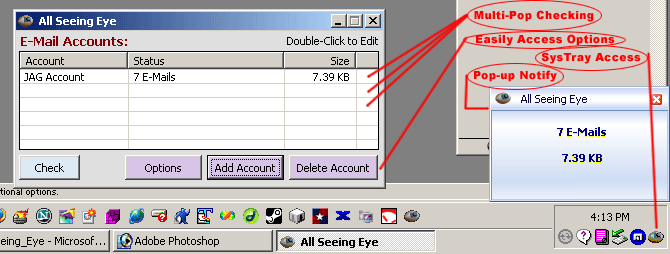



## Mulit\-Pop E\-Mail Checker

### Description

SEE SCREENSHOT! A Multi-Pop E-Mail checker (With help from many people including Gh&#8364;ttoWarr!or, for his MSN Popupbox) Totally written in VB (No external OCX/DLL files other than a few standard MS controls). Complete with sound, notification, color, and timing options. With sysTray support as well as "Form On Top" capability.
 
### More Info
 

             |
---                |---
**Submitted On**   |2004-09-02 16:18:38
**By**             |[\[\]\)utch\[\]v\[\]aster](https://github.com/Planet-Source-Code/PSCIndex/blob/master/ByAuthor/utch-v-aster.md)
**Level**          |Intermediate
**User Rating**    |4.8 (53 globes from 11 users)
**Compatibility**  |VB 6\.0
**Category**       |[Internet/ HTML](https://github.com/Planet-Source-Code/PSCIndex/blob/master/ByCategory/internet-html__1-34.md)
**World**          |[Visual Basic](https://github.com/Planet-Source-Code/PSCIndex/blob/master/ByWorld/visual-basic.md)
**Archive File**   |[\[All\_Seein178887922004\.zip](https://github.com/Planet-Source-Code/utch-v-aster-mulit-pop-e-mail-checker__1-55976/archive/master.zip)

